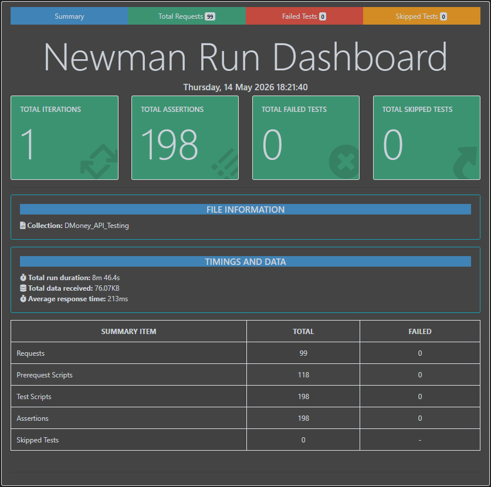
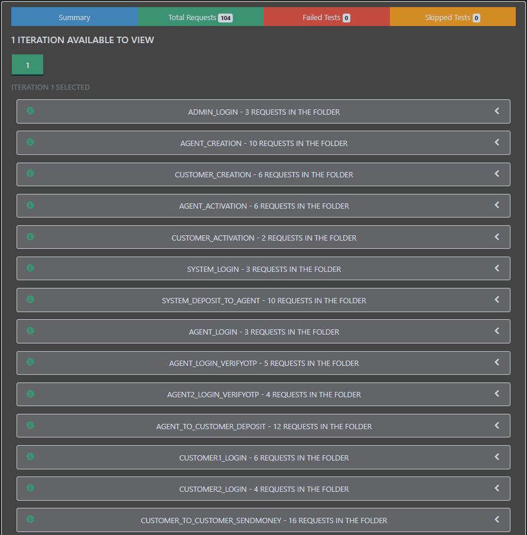

# Dmoney Manual & API Testing

## Project Description

This repository presents a professional-grade API testing project for the **Dmoney REST API**, focusing on financial transaction operations like deposits, transfers, withdrawals, and balance inquiries. It includes a complete suite of manual and automated test cases, detailed issue reports, and documentation to demonstrate best practices in API quality assurance.


## Key Features

* Comprehensive API testing covering functional, boundary, and negative test scenarios
* End-to-end manual and automated API test execution using Postman
* Execution of 99 API requests with 198 assertions and 100% test pass rate
* Detailed and interactive HTML test reporting with execution insights
* Validation of API responses, status codes, authentication, and business logic
* Well-documented bug reports and improvement recommendations for better API quality
* Clear test documentation and API traceability using official API references


---


## Documentation & Resources

| Resources                     | Link                                              |
| ---------------------------- | ------------------------------------------------- |
|  API Documentation         | [Postman_API_Collection](https://documenter.getpostman.com/view/49204800/2sBXqQFd13)                                     |
|  HTML Report               | [API_Collection_HTML_Report](https://dmoney-api-htmlreport.netlify.app/) |
|  Test Case File            | [DMoney_Test_Cases](https://docs.google.com/spreadsheets/d/1rBxuKHU7PGmhoNtWN5hx5IpEfwCpWngCkTcJ4HmVg9I/edit?usp=drive_web&ouid=112449756036362671762)                                 |
| Completion Report | [DMoney_Completion_Report](https://docs.google.com/spreadsheets/d/1g51xXvaBfLmyW8LiNfDsk_iW3x3Uy3WIw-Vup7spB6A/edit?gid=0#gid=0) |
|  Bug Report    | [DMoney_Bug_Report](https://docs.google.com/spreadsheets/d/1_UUlLQen29JL2y8VQH8SQOqGbLTgXCoiPt7ysk6WKXw/edit?gid=0#gid=0)                                 |
| Check List | [DMoney_Checklist](https://docs.google.com/spreadsheets/d/1B2vLeRM-1tHgn9cBrr6chfLsDPLv7cVGOCBHarUGe-U/edit)


---


## Technologies & Tools Used

| Tool                      | Purpose                                  |
| ------------------------- | ---------------------------------------- |
| **Postman**               | API Testing                       |
| **Newman**                | Generate detailed test reports           |
| **htmlextra**             | HTML reporting for test results |

---

## Report Screenshots




---

## How to Run This Project Locally

####  1. Clone the repo

```bash
git clone https://github.com/FarhadNuri/DMoney_Manual_and_API_Testing 
```

#### 2. Install dependencies

```bash
npm install dotenv
npm install newman
npm install newman-reporter-htmlextra
```

#### 3. Add gnailToken in dotenv from OAuth Gmail Api

```bash
gmailToken = secretGmailToken
```


#### 4. Generate HTML report

```bash
node .\report.js
```

   
---

## Experience & Insights Gained

* Designed and executed manual and automated API test cases using Postman and Newman
* Validated status codes, responses, authentication, and business logic across multiple scenarios
* Generated detailed HTML reports and maintained professional bug reports and QA documentation
* Strengthened practical knowledge of functional, boundary, and negative testing techniques
* Developed structured test cases with clear steps, expected results, and API requirements
